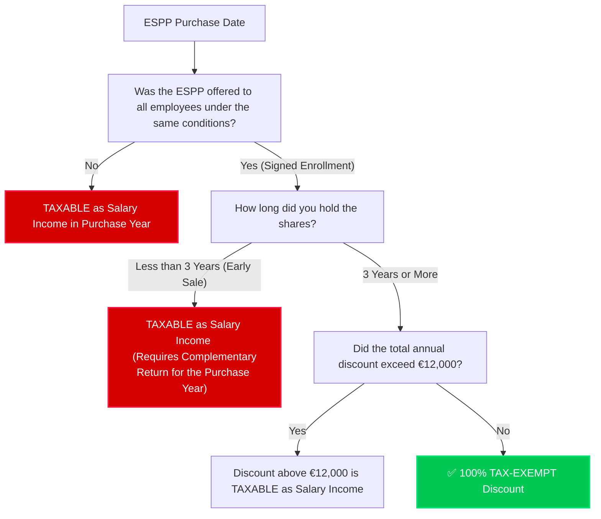

# Visual Tax Guide: Spanish ESPP & FIFO Tax Rules


This visual guide explains how Spanish tax law (Agencia Tributaria - Hacienda) treats Employee Stock Purchase Plan (ESPP) shares, the **3-Year Holding Exemption Rule**, and the hidden trap of **E-Trade's UI vs. Spanish FIFO (First-In, First-Out)** rules.

---

## 1. Quick Decision Tree: Is My ESPP Discount Taxable?

When you purchase ESPP shares, you get a discount (usually 15%). By default, this discount is considered **Salary Income** (*Rendimiento del Trabajo*). However, under Spanish law (Art. 42.3.f LIRPF), you can exempt this discount from taxes if you meet specific requirements. 

Here is how to determine if your ESPP discount is exempt or taxable:



---

## 2. The Danger: E-Trade Specific Lots vs. Spanish FIFO Rule

> [!WARNING]
> **This is the #1 mistake Spanish taxpayers make on E-Trade.**
> E-Trade lets you select exactly which shares to sell (e.g., "sell my RSU shares, keep my ESPP shares"). **Hacienda completely ignores this choice.**

Spanish law (Art. 37.2 LIRPF) mandates **FIFO (First-In, First-Out)** for homogeneous shares of the same company. When you sell *any* share on E-Trade, Hacienda considers that you sold your **oldest shares first**.

### How the FIFO Trap Triggers Early ESPP Sales:

Imagine this timeline of events:

```
[Dec 2023] ➔ Purchase 100 ESPP Shares (Discount: €500)
[Jun 2024] ➔ Vest 50 RSU Shares
[Nov 2024] ➔ You sell 50 shares, selecting RSU shares on E-Trade's UI.
```

#### E-Trade UI View (What you think happened):
* You sold: **50 RSU Shares** (Vested in Jun 2024)
* You still hold: **100 ESPP Shares** (Purchased in Dec 2023)
* *Your assumption:* "I haven't sold my ESPP, so I still qualify for the 3-year tax exemption!"

#### Spanish Tax Law View (What actually happened):
* Since the Dec 2023 ESPP shares are older than the Jun 2024 RSU shares, **FIFO applies**.
* You sold: **50 ESPP Shares** (Held for only 11 months!)
* You still hold: **50 ESPP Shares** and **50 RSU Shares**.
* *Result:* You broke the 3-year holding rule on 50 ESPP shares. The discount for those 50 shares is now **taxable**.

---

## 3. What Happens If I Break the 3-Year Rule?

If you sell ESPP shares before holding them for 3 years:

1. **Retroactive Taxation**: The discount corresponding to the sold shares is no longer tax-exempt. It must be declared as **Ordinary Salary Income** (*Rendimiento del Trabajo*).
2. **Tax Year Allocation**: The discount is taxed in the **Purchase Year**, not the Sale Year.
3. **Filing Requirement**: You must file a **Complementary Tax Return** (*Declaración Complementaria*) for the year you purchased the shares.
4. **Interest**: You will have to pay **Delay Interest** (*Intereses de Demora*), which is around 3-4% per year, calculated from the original tax filing deadline until the day you submit the complementary return.
   > [!TIP]
   > There are **no penalties** (multas) as long as you file the complementary return voluntarily before Hacienda sends you a formal notification/warning.

---

## 4. Forced Sales: Does Sell-to-Cover Count?

Yes. Even if a sale was automated and forced by your company or E-Trade to cover taxes upon vesting (Sell-to-Cover), Spanish law treats it as a standard sale. 
If FIFO determines that this Sell-to-Cover transaction consumed older ESPP shares that were not yet 3 years old, the 3-year rule is broken for those shares.

---

## 5. Summary Matrix: Declaring Your ESPP

| Scenario | Tax Category | Tax Return Year | Action Needed |
| :--- | :--- | :--- | :--- |
| **ESPP held 3+ years** | Capital Gain/Loss only | Sale Year | Declare capital gain/loss in Modelo 100 (*Base del Ahorro*). ESPP discount is exempt. |
| **ESPP sold early (< 3 years)** | Salary Income + Capital Gain/Loss | **Purchase Year** (for Salary) + **Sale Year** (for Gain/Loss) | 1. File a *Declaración Complementaria* for the purchase year to pay tax on the discount.<br>2. Declare capital gain/loss in the sale year return. |
| **ESPP sold immediately (same day)** | Salary Income | Purchase/Sale Year | Declare the full discount on that year's tax return. No capital gain/loss (or near zero). |

---

## 6. Proactive Tax Strategy

If you plan to sell all your stocks soon and know you will not hold your ESPP shares for the full 3 years, you have two options:

* **Option A (Reactive)**: Do not declare the discount during the purchase year. When you eventually sell early, file a *Declaración Complementaria* later and pay the tax + delay interest.
* **Option B (Proactive - Recommended)**: Declare the ESPP discount as standard taxable *Rendimiento del Trabajo* in the purchase year's original tax return. This avoids any future complementary returns and **saves you from paying delay interest**.

---

## 7. Notes for Your Tax Advisor (*Asesor Fiscal*)

Show this summary to your tax advisor to explain your tax engine report:
1. **FIFO Cost Basis:** All transactions are matched strictly using FIFO (Art. 37.2 LIRPF).
2. **ESPP Discount Tracking:** ESPP cost basis is recorded at Purchase FMV. Any early sales are detected and flagged so they can be declared on complementary returns.
3. **Double Taxation Avoidance:** The tax engine uses FMV as the cost basis to ensure you don't pay capital gains tax on the portion of the value that is already taxed as salary income.
