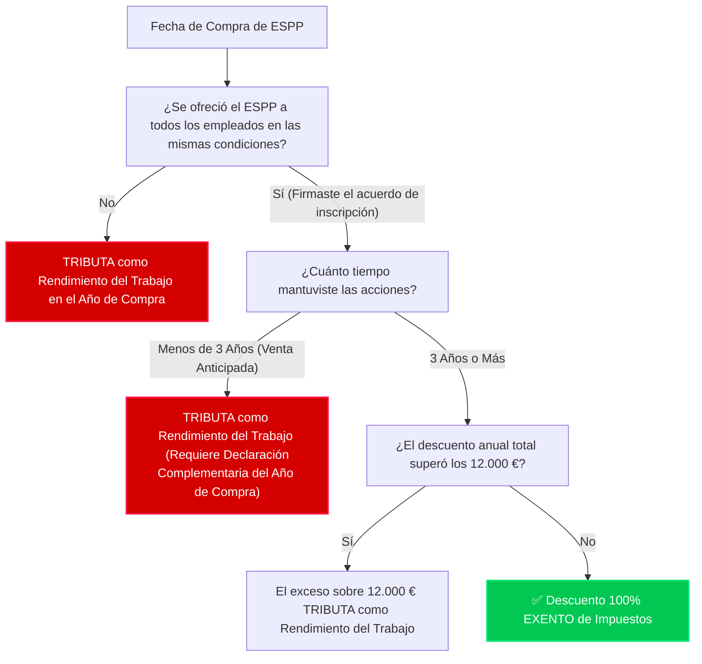

# Guía Visual: Reglas Fiscales para ESPP y FIFO en España


Esta guía visual explica cómo trata la Agencia Tributaria (Hacienda) las acciones adquiridas a través del plan de compra de acciones para empleados (**ESPP**), la **exención por mantenimiento de 3 años**, y la trampa oculta de la interfaz de **E-Trade frente a la regla FIFO en España**.

---

## 1. Árbol de Decisión: ¿Tengo que pagar impuestos por el descuento de mi ESPP?

Cuando compras acciones de ESPP, obtienes un descuento (normalmente del 15%). Por defecto, este descuento se considera **Rendimiento del Trabajo** en tu nómina o declaración. Sin embargo, bajo la ley española (Art. 42.3.f de la LIRPF), puedes eximir este descuento de tributar si cumples ciertos requisitos.

Usa este diagrama para comprobar si tu descuento está exento o tributa:



---

## 2. El Peligro: Selección de Lotes en E-Trade frente a la Regla FIFO en España

> [!WARNING]
> **Este es el error número 1 que cometen los contribuyentes españoles en E-Trade.**
> E-Trade te permite elegir exactamente qué acciones vender (por ejemplo, "vender mis RSU y mantener mis ESPP"). **Hacienda ignora por completo esta selección.**

La ley española (Art. 37.2 LIRPF) exige aplicar el método **FIFO (First-In, First-Out / Primero en entrar, primero en salir)** para acciones homogéneas de la misma empresa. Cuando vendes *cualquier* acción en E-Trade, Hacienda considera que has vendido tus **acciones más antiguas primero**.

### Cómo la trampa del FIFO provoca ventas anticipadas de ESPP:

Imagina esta cronología de eventos:

```
[Dic 2023] ➔ Compras 100 acciones de ESPP (Descuento: 500 €)
[Jun 2024] ➔ Se liberan (vest) 50 acciones de RSU
[Nov 2024] ➔ Vendes 50 acciones seleccionando "RSU" en la web de E-Trade.
```

#### Vista en la web de E-Trade (Lo que tú crees que ha pasado):
* Has vendido: **50 acciones de RSU** (adquiridas en junio de 2024)
* Mantienes: **100 acciones de ESPP** (compradas en diciembre de 2023)
* *Tu conclusión:* "No he vendido mis ESPP, ¡así que sigo teniendo derecho a la exención de los 3 años!"

#### Vista de Hacienda / Regla FIFO (Lo que realmente ha pasado):
* Como las acciones de ESPP de diciembre de 2023 son más antiguas que las RSU de junio de 2024, **se aplica FIFO**.
* Has vendido: **50 acciones de ESPP** (¡mantenidas solo durante 11 meses!)
* Mantienes: **50 acciones de ESPP** y **50 de RSU**.
* *Resultado:* Has roto la regla de los 3 años para esas 50 acciones de ESPP. El descuento correspondiente a esas acciones ahora **tributa**.

---

## 3. ¿Qué ocurre si rompo la regla de los 3 años?

Si vendes acciones de ESPP antes de cumplir los 3 años desde su compra:

1. **Pérdida de la exención**: El descuento de las acciones vendidas deja de estar exento y tributa como **Rendimiento del Trabajo** ordinario en la escala general (como tu salario).
2. **Imputación temporal**: El descuento tributa en el **Año de Compra**, no en el año de la venta.
3. **Obligación formal**: Debes presentar una **Declaración Complementaria** para el año en que compraste las acciones.
4. **Intereses de demora**: Deberás pagar **Intereses de Demora** (alrededor del 3-4% anual) calculados desde el fin de la campaña de renta de ese año de compra hasta la fecha de presentación.
   > [!TIP]
   > Presentar la complementaria de forma voluntaria **no conlleva multas ni sanciones**, solo los intereses de demora por el retraso.

---

## 4. Ventas Forzadas: ¿Cuenta el "Sell-to-Cover"?

Sí. Aunque una venta haya sido automática y forzada por tu empresa o E-Trade para retener impuestos al recibir RSU (Sell-to-Cover), la ley española la considera una venta normal.
Si por FIFO esa venta consume acciones de ESPP más antiguas que aún no han cumplido los 3 años, se romperá la regla de los 3 años para esas acciones.

---

## 5. Matriz de Declaración de ESPP

| Escenario | Categoría Fiscal | Año de Declaración | Acción Requerida |
| :--- | :--- | :--- | :--- |
| **ESPP mantenido 3+ años** | Solo Ganancia/Pérdida Patrimonial | Año de la Venta | Declarar ganancia/pérdida en la Base del Ahorro (Modelo 100). El descuento está exento. |
| **ESPP vendido antes de 3 años** | Rendimiento del Trabajo + Ganancia/Pérdida Patrimonial | **Año de Compra** (para el descuento) + **Año de Venta** (para la ganancia) | 1. Presentar *Declaración Complementaria* del año de compra para tributar por el descuento.<br>2. Declarar la ganancia/pérdida en la renta del año de venta. |
| **ESPP vendido el mismo día** | Rendimiento del Trabajo | Año de la Compra/Venta | Declarar el descuento completo en la nómina o renta de ese año. Ganancia patrimonial cero (o casi cero). |

---

## 6. Estrategia Fiscal Recomendada

Si sabes de antemano que vas a vender tus acciones y no vas a aguantar el ESPP los 3 años requeridos:

* **Opción A (Reactiva)**: No declares el descuento en el año de compra. Cuando las vendas antes de tiempo, presenta la *Declaración Complementaria* pagando el impuesto y los intereses de demora correspondientes.
* **Opción B (Proactiva - Recomendada)**: Declara el descuento del ESPP como *Rendimiento del Trabajo* ordinario en la declaración de la renta original del año de compra. Así te ahorrarás trámites en el futuro y **evitarás pagar intereses de demora**.

---

## 7. Notas para tu Asesor Fiscal

Muestra este resumen a tu gestor para explicarle el informe del motor fiscal:
1. **Método FIFO estricto:** Todas las operaciones de venta se cruzan con las compras más antiguas (Art. 37.2 LIRPF).
2. **Cálculo del coste de adquisición:** Las RSU y ESPP se registran al valor de mercado (FMV) de la fecha de entrega/compra para evitar la doble imposición.
3. **Detección de ventas anticipadas de ESPP:** El programa detecta automáticamente qué lotes de ESPP se han consumido antes de los 3 años para que puedan declararse correctamente mediante declaraciones complementarias.
