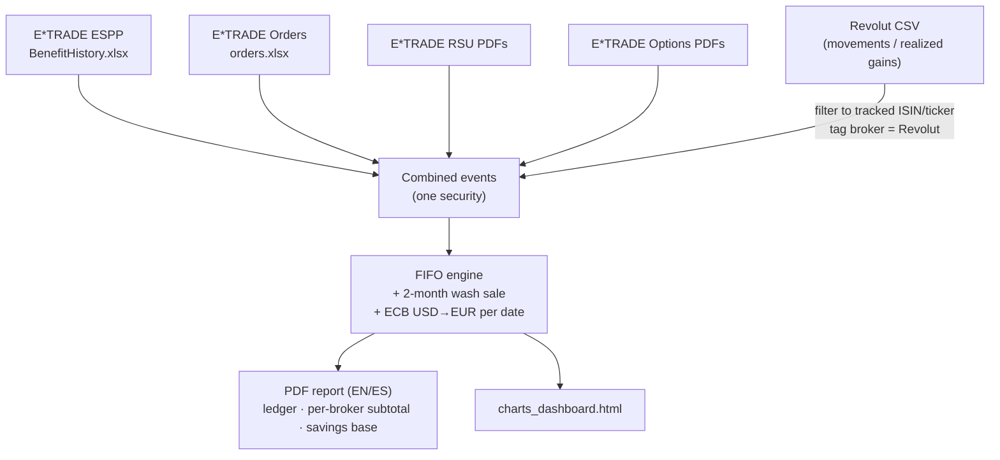

# Spanish FIFO Tax Calculation Method & Compliance Audit

This document explains the calculation methodology used by the Spanish Tax Engine to process E-Trade stock data (RSUs, ESPPs, Stock Options) and analyzes the engine's compliance with Spanish Tax Law (LIRPF).

---

## 1. Executive Verdict & Compliance Checklist

The engine implements a fully compliant First-In, First-Out (FIFO) calculation system specifically tailored to the requirements of the Spanish Tax Agency (*Agencia Tributaria - Hacienda*).

| Regulatory / Technical Requirement | Status | Legal Basis / Reference |
| :--- | :---: | :--- |
| **FIFO Lot Matching** | ✅ Compliant | Art. 37.2 LIRPF — Strict homogeneous matching |
| **ECB Exchange Rates (USD → EUR)** | ✅ Compliant | Official daily European Central Bank lookup rates |
| **Progressive Savings Tax Scales** | ✅ Compliant | Art. 66 LIRPF — Up-to-date 2024–2026 tax bands (19% to 28%) |
| **2-Month Wash Sale Rule** | ✅ Compliant | Art. 33.5.f LIRPF — Anti-avoidance (proportional blocking) |
| **Fee Deductions** | ✅ Compliant | Art. 35.1 & 35.2 LIRPF — Deductible *gastos inherentes* |
| **RSU Vesting Cost Basis** | ✅ Compliant | FMV at release date (prevents double taxation) |
| **ESPP Purchase Cost Basis** | ✅ Compliant | FMV at purchase date |
| **ESPP 3-Year Holding Period** | ✅ Auto-Detected | Art. 42.3.f LIRPF — Identifies early sales and salary tax |
| **4-Year Loss Carryforward** | ⚠️ Simulated | Art. 49 LIRPF — Carryforward Ledger across tracked years; seed pre-window losses via `prior_losses.json` (see §4.1) |
| **Cross-Category Offset (25% cap)** | ⚠️ Simulated | Art. 49 LIRPF — Computed when you supply `savings_income.json` (dividends/interest); cap is year-aware (see §4.1) |
| **Modelo 720 (Foreign Assets)** | ❌ Out of Scope | Separate annual obligation (if assets abroad > €50,000) |

---

## 2. Core Calculation Methodology

### Data Flow

Every source is converted into the same `StockEvent` stream, tagged with its broker, and fed through one FIFO queue. Revolut rows are filtered to the single tracked security before they join the pool (see *FIFO Scope* below).

### FIFO Lot Matching (First-In, First-Out)
Under Spanish law (**Art. 37.2 LIRPF**), shares of the same company are homogeneous. When you execute a sell order, the engine matches the sold shares against your oldest available share acquisitions in chronological order.
* Realized gain/loss is calculated per lot:
  $$\text{Realized Gain/Loss} = (\text{Selling Price in EUR} - \text{Acquisition Cost in EUR}) \times \text{Shares}$$
* If a single sell transaction spans multiple purchase lots, the transaction is split and calculated on a per-lot basis.
* Stale lots are completely cleared once their remaining shares reach `0`.

### FIFO Scope: Per Security, Not Across Securities
FIFO is applied **per homogeneous security** — i.e. per ISIN (Art. 37.2 LIRPF). Each security has its **own independent FIFO queue**: a sale of *DT* can only be matched against earlier acquisitions of *DT*, never against *TSLA* or *NVDA*. You never FIFO-match across different tickers.

* **This engine processes one security at a time.** It assumes every input transaction is the same homogeneous security (in practice, your employer's stock, e.g. DT) and keeps a single FIFO queue. The optional Revolut import is therefore **filtered down to that one security** (by ISIN, or by ticker for the movements export); rows for other tickers are discarded.
* **Other securities are still taxable and must be declared separately.** If you also bought and sold *other* tickers on Revolut (TSLA, NVDA, ADBE, …), each of those is its own FIFO calculation that this tool does **not** compute. Run the engine once per ticker (set `input/ticker.json` accordingly), or have those handled separately, and combine the results as below.

**How it rolls up for Hacienda (Modelo 100, base del ahorro):**
1. Compute each security's net gain/loss with its **own** FIFO queue (per ISIN).
2. **Sum** all securities' results into the single *ganancias y pérdidas patrimoniales* bucket of the savings base — losses on one security offset gains on another within this bucket (they are not ring-fenced per security).
3. That net then cross-offsets (up to the 25% cap) against the dividends/interest (RCM) bucket, and any remainder carries forward 4 years (Art. 49 LIRPF).

So **FIFO is per security, but the taxable result is the aggregate** of all of them in the savings base.

### Transaction Processing Order (Same-Day Events)
To prevent negative share inventory errors and ensure correct FIFO matching for same-day sell-to-cover actions, events occurring on the same calendar day are sorted as follows:
1. **VEST / BUY / EXERCISE** (all acquisitions)
2. **SELL** (all sales, including sell-to-cover)

### Currency Conversion
All values are converted from USD to EUR:
1. Uses the official European Central Bank (ECB) daily exchange rate.
2. Inverts the ECB's official EUR/USD rate to obtain the correct USD/EUR rate.
3. Automatically falls back to the closest preceding business day's rate for weekends and market holidays.

---

## 3. Advanced Spanish Tax Compliance Rules

### The 2-Month Wash Sale Rule (*Norma de los Dos Meses*)
Under **Art. 33.5.f LIRPF**, you cannot declare capital losses from a sale if you acquired homogeneous shares within **2 months before or after** that sale. 
* **Proportional Blocking:** The blocked loss is limited to the number of replacement shares.
  $$\text{Blocked Shares} = \min(\text{Sold Shares}, \text{Replacement Shares Remaining in Portfolio})$$
* **Correct Application:** The engine only blocks losses against replacement shares that *remain in your portfolio* (shares consumed by the sell itself do not trigger a wash sale).
* **Filing Treatment:** Blocked losses are deferred and cannot offset gains in the current tax year. They are carried forward as "blocked" until the replacement shares are sold.

### Transaction & Transfer Fee Deductions (*Gastos Inherentes*)
According to **Art. 35.1 and 35.2 LIRPF**, commissions and fees directly related to the acquisition or transmission of shares are deductible.
* The engine automatically parses and deducts **Commissions**, **SEC Fees**, and **Brokerage Assist Fees** from capital gains.
* Users can manually record platform wire transfer fees (for transferring cash out of E-Trade) in the input file to have them deducted as inherent transaction costs.

### ESPP 3-Year Holding Period Exemption (Art. 42.3.f LIRPF)
Discounts on ESPP purchases (up to €12,000/year) are tax-exempt if:
1. The shares are held for at least **3 years** from the purchase date.
2. The ESPP program was offered to all employees under the same conditions (verified via company enrollment sign-off).

**Early Sale Detection:**
* The engine scans all FIFO sales. If ESPP shares are sold before the 3-year mark, the engine flags the corresponding purchase discount as **taxable salary income** (*Rendimiento del Trabajo*).
* The tax is imputed to the **Purchase Year**, requiring a **Complementary Tax Return** (*Declaración Complementaria*) for that year, which may incur delay interest but no penalties if filed voluntarily.

---

## 4. Scope Limitations & Caveats

> **Why these are not automated:** each item below needs data the engine never sees — your results from *other years*, or income from *other categories* (dividends, interest). These belong in the final Modelo 100, where everything is aggregated. The engine produces a per-year, single-instrument worksheet; the rules below are applied on top of it at filing time.

### 4.1 Loss Handling (Art. 48 & 49 LIRPF)

The engine's **Yearly Tax Summary** reports each year's gains and losses independently. On top of that, the **Loss Carryforward Ledger** simulates the year-to-year offset; cross-category offset still happens at filing time.

**a) 4-year carryforward (Art. 49 LIRPF).** If your *savings base* (base del ahorro) is net negative in a year — total losses exceed total gains — the loss is not lost. It carries forward to offset gains over the **next 4 years**. The Carryforward Ledger applies this automatically across the tracked years (oldest losses first) and flags any that expire unused.

> *Example:* 2024 nets −€3,000 (pay €0 tax, carry −€3,000 forward). 2025 has +€5,000 in gains → offset the carried −€3,000, so only €2,000 is taxed. The ledger now shows this directly. **Losses from before your imported data window** aren't visible to the engine — seed them with `input/prior_losses.json` (e.g. `{"2024": 3000}`) or `--prior-losses <file>`.

**b) Cross-category offset, 25% cap (Art. 49 LIRPF).** The savings base has two ringfenced buckets: *capital gains/losses* (your stock sales) and *returns on movable capital* (dividends, interest). A net loss in one bucket may offset up to **25%** of the positive balance in the other (the cap is year-dependent: 10% in 2015, 15% in 2016, 20% in 2017, 25% from 2018).

> *Example:* a −€2,000 net stock loss can reduce your taxable dividend/interest income by up to 25% of that income in the same year; any unused remainder carries forward for 4 years. The engine computes this **when you supply `input/savings_income.json`** (dividends/interest in EUR); otherwise it only sees stock transactions. Foreign tax withheld is reported for reference — the *deducción por doble imposición internacional* is applied by your advisor.

**What to give your advisor:** this engine's net gain/loss per year, so they can slot it into the carryforward and cross-category boxes of Modelo 100 alongside your other savings income.

### 4.2 Other limitations

2. **Single Ticker Assumption:** The engine assumes all input transactions apply to the same company stock (in practice, your employer's shares). If you trade multiple tickers, separate files must be processed to prevent FIFO lot mixing. *Exception:* the optional Revolut export (`input/revolut/*.csv`) may contain many tickers — the engine filters it down to the tracked security (by **ISIN** for the realized-gains export, or by **ticker** for the account-movements export, which has no ISIN) per `input/ticker.json`, and discards the rest, so only homogeneous shares enter the FIFO pool. The movements export also contributes **buys** for shares you never sold, completing the cost-basis pool.

   **Cross-broker scope (Revolut):** by default the wash-sale rule and FIFO ordering only see this E\*TRADE account. If you held the *same* security (same ISIN) on Revolut, dropping its P&L CSV into `input/revolut/` merges those buys/sells into the **same FIFO queue**, so cross-broker FIFO and the 2-month rule are evaluated correctly across both — as Spain requires for valores homogéneos. This requires the **complete acquisition history** for that security; otherwise the global queue can go negative and the engine raises an error.
3. **Modelo 720:** If your foreign bank accounts or stock portfolios (like E-Trade) exceed a value of €50,000 at any point during the year (or as of Dec 31st), you must file the Modelo 720 informative declaration. The engine does not generate this form.

---

## 5. Notes for Your Tax Advisor & Hacienda

### Summary for Your Asesor Fiscal
Provide the following information to your gestor when submitting your report:
* "This report uses a strict **FIFO cost basis matching** and applies official **ECB daily exchange rates** on transaction dates."
* "Transaction fees (Commissions, SEC, and Brokerage Assist) have been deducted as *gastos inherentes* (Art. 35 LIRPF)."
* "The **2-month wash sale rule** (Art. 33.5.f LIRPF) has been applied to defer losses where replacement shares remain in the portfolio."
* "The engine scans for **ESPP early sales** (< 3 years) and separates the discount amount to be declared as *Rendimiento del Trabajo* via a *Declaración Complementaria* for the purchase year."

### For Hacienda
The Spanish PDF report (`tax_report_ES_*.pdf`) generated by the engine is formatted to serve as proof for the Agencia Tributaria. It contains a complete ledger of transactions, individual FIFO lot-matching details, and calculations for both capital gains (*Base del Ahorro*) and salary adjustments (*Rendimiento del Trabajo*).
